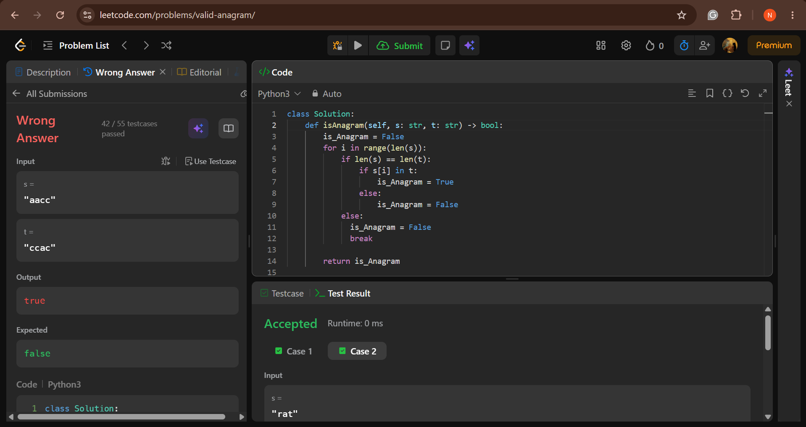
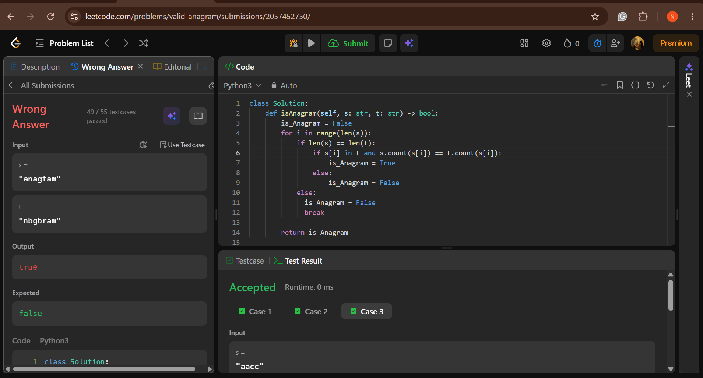
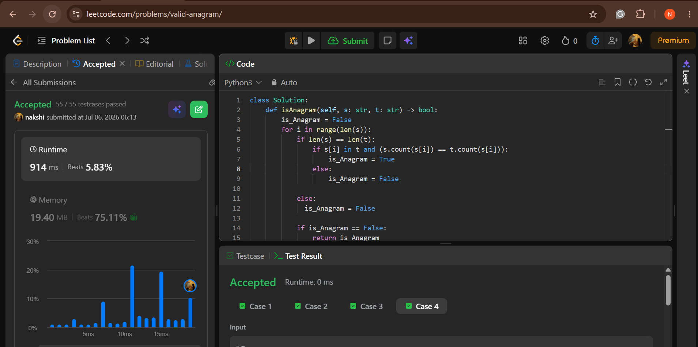
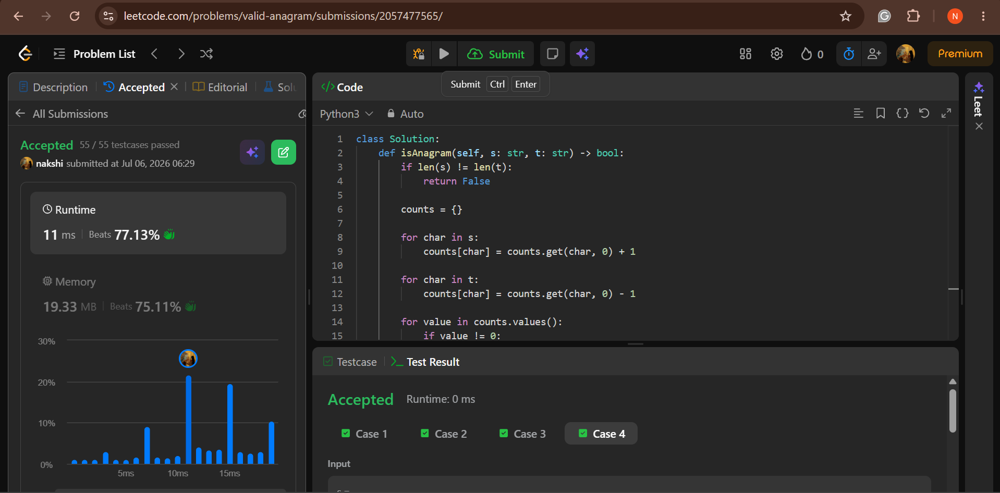
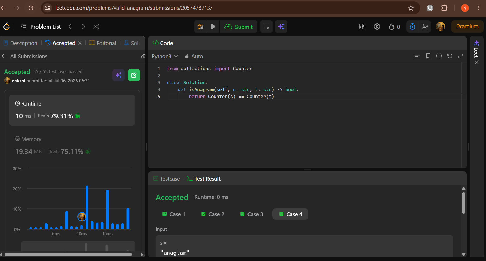

### 2. Valid Anagram

Given two strings `s` and `t`, return `true` if `t` is an anagram of `s` (contains the same letters, the same number of times, just rearranged), and `false` otherwise.

**Files:** [`myTrialSolution1.py`](myTrialSolution1.py) · [`myTrialSolution2.py`](myTrialSolution2.py) · [`workingSolution1.py`](WorkingSolution1.py) · [`workingSolution2&3.py`](WorkingSolution2&3.py)

---

#### Trial 1: `in` check only (Wrong Answer)

```python
class Solution:
    def isAnagram(self, s: str, t: str) -> bool:
        is_Anagram = False
        for i in range(len(s)):
            if len(s) == len(t):
                if s[i] in t:
                    is_Anagram = True
                else:
                    is_Anagram = False
            else:
              is_Anagram = False
              break  
        
        return is_Anagram
```

**Bug:** only checks if each character *exists* in `t`, not how many times it appears. So `"aacc"` vs `"ccac"` incorrectly passes as `True`, because every character in `s` does appear somewhere in `t` — even though the counts don't match.



---

#### Trial 2: Add count check, but flag isn't reset properly (Wrong Answer)

```python
class Solution:
    def isAnagram(self, s: str, t: str) -> bool:
        is_Anagram = False
        for i in range(len(s)):
            if len(s) == len(t):
                if s[i] in t and (s.count(s[i]) == t.count(s[i])):
                    is_Anagram = True
                else:
                    is_Anagram = False

            else:
              is_Anagram = False  
            
            if is_Anagram == False:
                return is_Anagram
                break
        
        return is_Anagram
```

**Improvement:** now checks `s.count(char) == t.count(char)`, which correctly compares frequency, not just presence.

**Remaining bug:** fails on `"anagtam"` vs `"nbgbram"` — checking count-equality per character one at a time, while returning early on any single mismatch, isn't quite the same as verifying the *entire* multiset of letters matches. Also still doesn't handle empty strings as anagrams correctly.



---

#### Working Solution 1: Dictionary counter (O(n))

```python
class Solution:
    def isAnagram(self, s: str, t: str) -> bool:
        if len(s) != len(t):
            return False
        
        counts = {}
        
        for char in s:
            counts[char] = counts.get(char, 0) + 1
        
        for char in t:
            counts[char] = counts.get(char, 0) - 1
        
        for value in counts.values():
            if value != 0:
                return False
        
        return True
```

**How it works:**
- Length check up front — different lengths can never be anagrams
- Build a tally of letter counts from `s` (`+1` for each occurrence)
- Subtract using `t` (`-1` for each occurrence)
- If `s` and `t` are true anagrams, every letter cancels out to exactly `0`
- Any nonzero value means the letters didn't match up

**Time complexity:** O(n) — one pass through `s`, one pass through `t`, one pass through the counts.
**Space complexity:** O(1) — at most 26 lowercase letters possible, so the dictionary size is capped regardless of string length.

**Result:** 55/55 test cases passed, 11 ms runtime.



---

#### Working Solutions 2 & 3: Built-in `Counter`

```python
from collections import Counter

class Solution:
    def isAnagram(self, s: str, t: str) -> bool:
        return Counter(s) == Counter(t)
```

**How it works:** `Counter` is Python's built-in tool that automatically builds the same `{letter: count}` dictionary as above. Comparing two `Counter` objects with `==` checks that all counts match exactly — same logic as Working Solution 1, condensed into one line.

**Result:** 55/55 test cases passed, 10 ms runtime.





---

#### Comparison

| Version              | Result        | Runtime | Notes                                              |
|----------------------|---------------|---------|-----------------------------------------------------|
| Trial 1              | Wrong Answer  | —       | Only checks letter presence, not frequency          |
| Trial 2              | Wrong Answer  | —       | Checks frequency, but early-return logic is flawed  |
| Working Solution 1   | Accepted      | 11 ms   | Manual dictionary counter, O(n)                     |
| Working Solutions 2&3| Accepted      | 10 ms   | `Counter` built-in, same logic, less code            |
